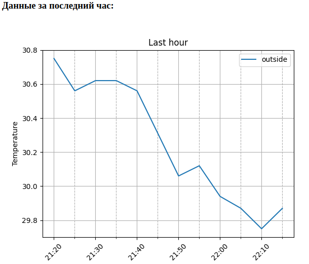
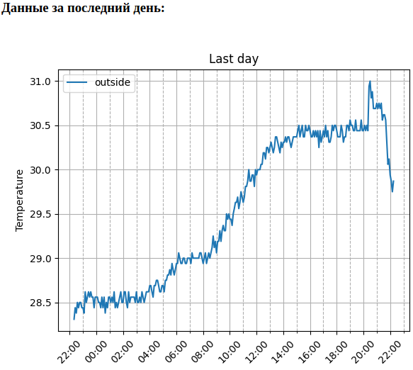
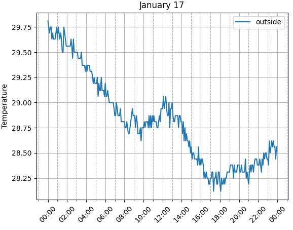

#### mini smartHome server  
Mini web server to display graphs of the resulting temperature values.  

Displays:  
- the last temperature obtained;  
- schedule for the last:  
    - an hour;  
    - day;  
    - week;  
    - two weeks;  
    - 30 days;  
- as well as ridic charts for an obsessed day and a month.  

For start server:  
    `python3 -m http.server 8123 --cgi`  

Screens:  
  
  
  
